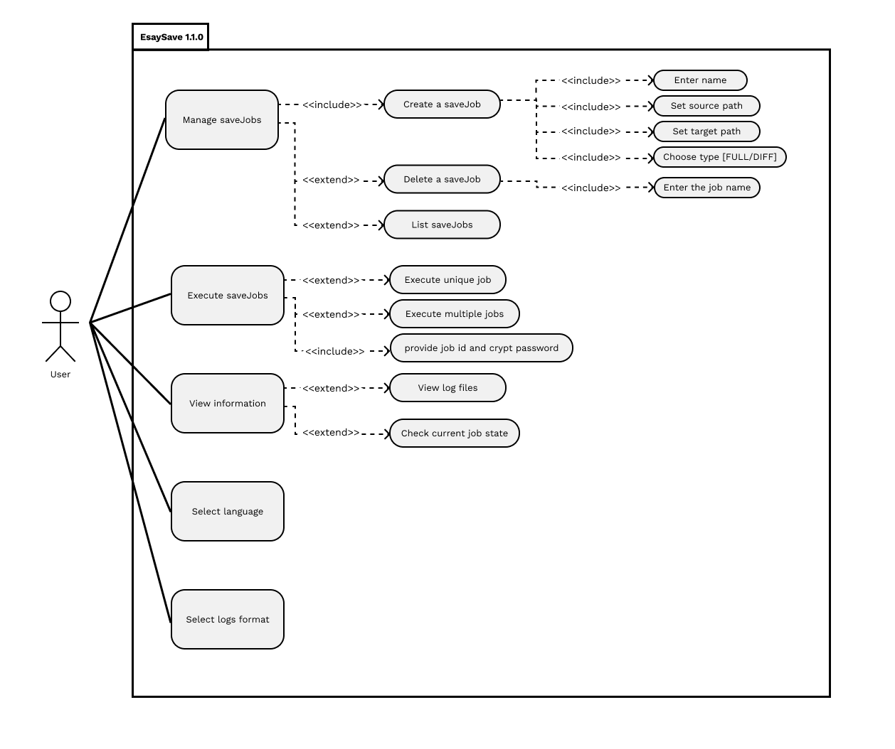
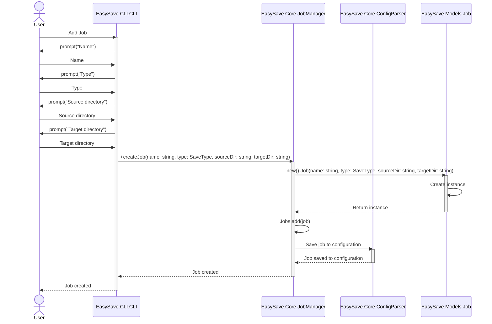
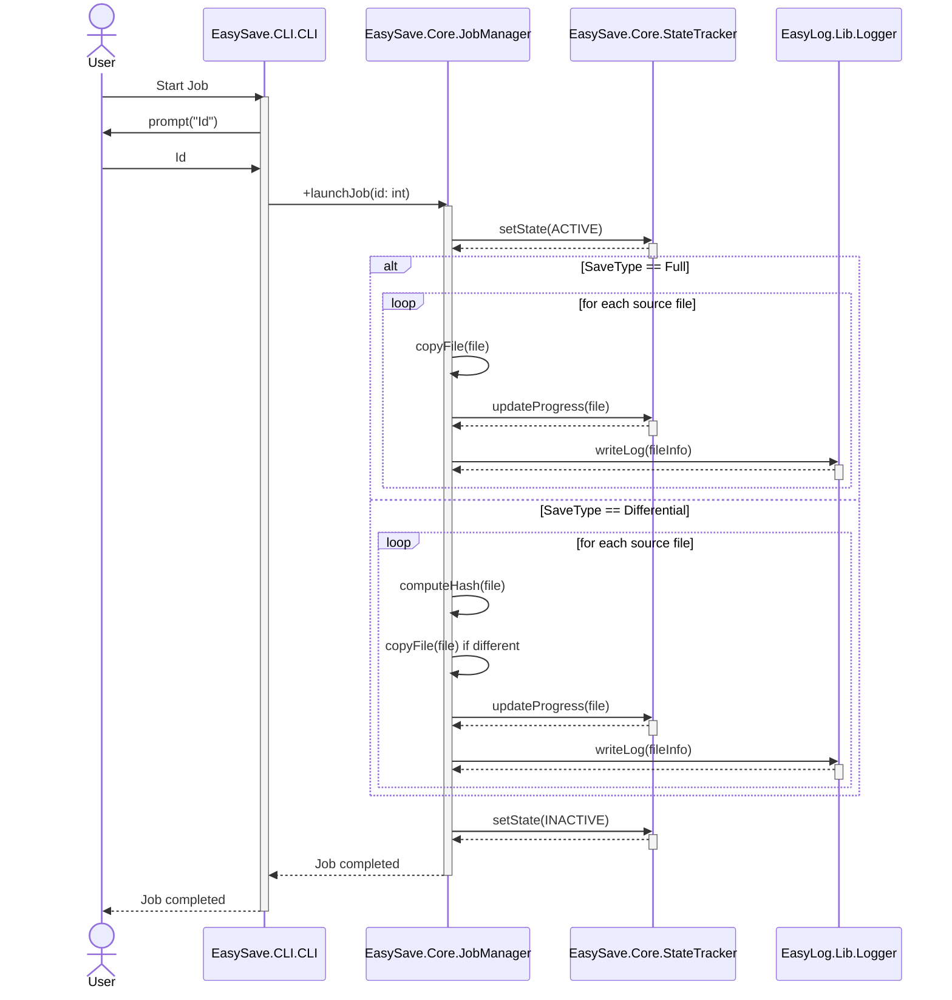
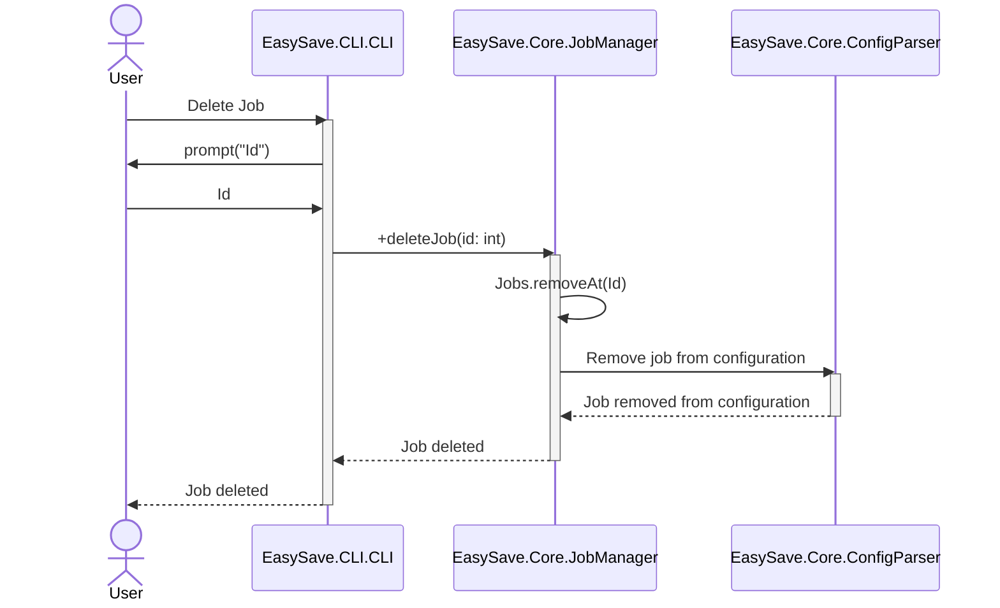
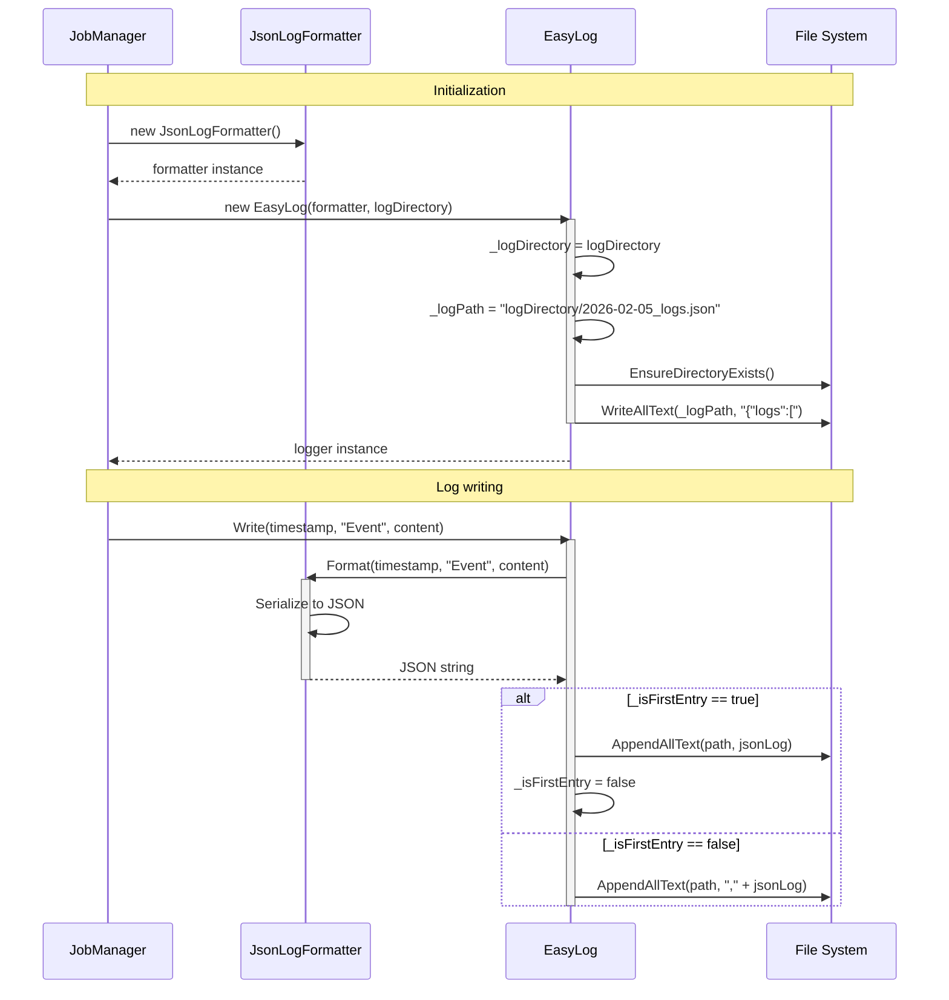

# UML Modeling - EasySave

This document contains the UML diagrams of the **EasySave** project, created with [Mermaid](https://mermaid.js.org/).

## 1. Use Case Diagram




## 2. Class Diagram

Overview of the main classes of the project and their relationships.

### 2.1. Simplified version

```mermaid
classDiagram
  CLI --> JobManager
  App --> MainWindow
  MainWindow --> JobManager

  JobManager *-- "0..5" Job
  JobManager o-- EasyLog
  JobManager o-- StateTracker
  JobManager --> ConfigParser
  JobManager o-- ILogFormatter

  ConfigParser ..> Job

  Job --> JobType
  StateEntry --> JobState

  EasyLog o-- ILogFormatter
  ILogFormatter <|.. JsonLogFormatter
  ILogFormatter <|.. XmlLogFormatter

  JobManager ..> LogEntry
  JobManager ..> StateEntry
  StateTracker ..> StateEntry

  namespace EasySave.CLI {
    class CLI {
      -JobManager _jobManager
      +WriteLine(message: string) void
      +start() void
      -CreateJob() void
      -DeleteJob() void
      -ShowJobs() void
      -ChangeLanguage() void
      -ExecuteJobs() void
    }
  }

  namespace EasySave.GUI {
    class App {
      +Initialize() void
      +OnFrameworkInitializationCompleted() void
    }

    class MainWindow {
      -JobManager _jobManager
      +MainWindow()
      -OnJobsClick(sender: object, e: RoutedEventArgs) void
      -OnLogsClick(sender: object, e: RoutedEventArgs) void
      -OnStateClick(sender: object, e: RoutedEventArgs) void
      -OnSettingsClick(sender: object, e: RoutedEventArgs) void
    }
  }

  namespace EasySave.Core {
    class JobManager {
      -List~Job~ _jobs
      -EasyLog _logger
      -ConfigParser _configParser
      -ILogFormatter _logFormatter
      -StateTracker _stateTracker
      +CreateJob(name: string, type: JobType, sourcePath: string, destinationPath: string) void
      +removeJob(index: int) void
      +GetJobs() List~Job~
      +Close() void
      +LaunchJob(job: Job, password: string) void
      +CheckBusinessApplications() string?
      -CreateLogFormatter() ILogFormatter
      -LoadJobsFromConfig() void
      -SaveJobToConfig(job: Job) void
      -RemoveJobFromConfig(jobName: string) void
      -ExecuteFullBackup(job: Job, createHashFile: bool) void
      -ExecuteDifferentialBackup(job: Job) void
    }

    class StateTracker {
      -string _stateFilePath
      -Dictionary~string, StateEntry~ _jobStates
      +UpdateJobState(stateEntry: StateEntry) void
      +RemoveJobState(jobName: string) void
    }

    class ConfigParser {
      -string _configPath
      +JsonNode? Config
      +LoadConfig() void
      +EditAndSaveConfig(newConfig: JsonNode) void
      +saveJobs(jobs: List~Job~) void
      -SaveConfig() void
    }
  }

  namespace EasySave.Models {
    class Job {
      +string Name
      +JobType Type
      +string SourcePath
      +string DestinationPath
      +ToString() string
    }

    class JobType {
      <<enumeration>>
      Full
      Differential
    }

    class LogEntry {
      +DateTime Timestamp
      +string BackupName
      +string SourcePath
      +string DestinationPath
      +long FileSize
      +int TransferTimeMs
      +ToNormalizedFormat() (DateTime, string, Dictionary~string, object~)
    }

    class StateEntry {
      +string JobName
      +DateTime LastActionTime
      +JobState State
      +int? TotalFiles
      +long? TotalSizeToTransfer
      +double? Progress
      +int? RemainingFiles
      +long? RemainingSizeToTransfer
      +string? CurrentSourcePath
      +string? CurrentDestinationPath
      +ToString() string
    }

    class JobState {
      <<enumeration>>
      Active
      Inactive
    }
  }

  namespace EasyLog.lib {
    class EasyLog {
      -ILogFormatter _formatter
      -string _logDirectory
      -string _logPath
      -bool _isFirstEntry
      -DateTime _currentDate
      -string _fileExtension
      -string _entrySeparator
      +Write(timestamp: DateTime, name: string, content: Dictionary~string, object~) void
      +SetLogPath(newLogDirectory: string) void
      +GetCurrentLogPath() string
      +GetLogDirectory() string
      +Close() void
      -GetLogPathForDate(date: DateTime) string
      -InitializeLogStructure() void
      -EnsureFileIsOpen() void
      -NormalizePathsInContent(content: Dictionary~string, object~) void
      -ConvertToUncPath(path: string) string
      -CheckAndRotateIfNeeded() void
      -EnsureDirectoryExists(directory: string) void
    }

    class ILogFormatter {
      <<interface>>
      +Format(timestamp: DateTime, name: string, content: Dictionary~string, object~) string
      +Close(filePath: string) void
    }

    class JsonLogFormatter {
      +Format(timestamp: DateTime, name: string, content: Dictionary~string, object~) string
      +Close(filePath: string) void
    }

    class XmlLogFormatter {
      +Format(timestamp: DateTime, name: string, content: Dictionary~string, object~) string
      +Close(filePath: string) void
      -SanitizeXmlElementName(name: string) string
    }
  }
```

### 2.2. Detailed version

This version details all components of the GUI module with all its associated namespaces (Pages, Components, Dialogs, Converters). It shows the complete internal structure of the graphical interface.

```mermaid
classDiagram
  CLI --> JobManager
  App --> MainWindow
  MainWindow --> JobManager
  MainWindow *-- JobsPage
  MainWindow *-- LogsPage
  MainWindow *-- StatePage
  MainWindow *-- SettingsPage

  JobsPage --> JobManager
  JobsPage *-- "0..5" JobCard
  JobsPage --> CreateJobDialog
  JobsPage --> ErrorDialog
  JobsPage --> PasswordDialog

  LogsPage --> ConfigParser
  LogsPage --> JobManager
  LogsPage *-- "0..*" SimpleLogEntry

  SettingsPage --> ConfigParser
  SettingsPage --> JobManager

  JobCard --> Job
  JobCard --> JobTypeColorConverter

  CreateJobDialog --> JobResult
  CreateJobDialog --> JobType

  JobManager *-- "0..5" Job
  JobManager o-- EasyLog
  JobManager o-- StateTracker
  JobManager --> ConfigParser
  JobManager o-- ILogFormatter

  ConfigParser ..> Job

  Job --> JobType
  StateEntry --> JobState

  EasyLog o-- ILogFormatter
  ILogFormatter <|.. JsonLogFormatter
  ILogFormatter <|.. XmlLogFormatter

  JobManager ..> LogEntry
  JobManager ..> StateEntry
  StateTracker ..> StateEntry

  namespace EasySave.CLI {
    class CLI {
      -JobManager _jobManager
      +WriteLine(message: string) void
      +start() void
      -CreateJob() void
      -DeleteJob() void
      -ShowJobs() void
      -ChangeLanguage() void
      -ExecuteJobs() void
    }
  }

  namespace EasySave.GUI {
    class App {
      +Initialize() void
      +OnFrameworkInitializationCompleted() void
    }

    class MainWindow {
      -JobManager _jobManager
      -JobsPage _jobsPage
      -LogsPage _logsPage
      -StatePage _statePage
      -SettingsPage _settingsPage
      +MainWindow()
      -OnJobsClick(sender: object, e: RoutedEventArgs) void
      -OnLogsClick(sender: object, e: RoutedEventArgs) void
      -OnStateClick(sender: object, e: RoutedEventArgs) void
      -OnSettingsClick(sender: object, e: RoutedEventArgs) void
    }
  }

  namespace EasySave.GUI.Pages {
    class SimpleLogEntry {
      +string LogText
    }

    class JobsPage {
      -JobManager _jobManager
      +JobsPage()
      +JobsPage(jobManager: JobManager)
      -LoadJobs() void
      -CreateJobButton_Click(sender: object, e: RoutedEventArgs) void
      -OnJobPlay(sender: object, job: Job) void
      -OnJobDelete(sender: object, data: (int, Job)) void
    }

    class LogsPage {
      -ObservableCollection~SimpleLogEntry~ _logs
      -ConfigParser _configParser
      -JobManager? _jobManager
      -FileSystemWatcher? _fileWatcher
      -string _currentLogFilePath
      -Timer? _reloadTimer
      -object _reloadLock
      +LogsPage()
      +LogsPage(configParser: ConfigParser, jobManager: JobManager)
      -LoadLogs() void
      -LoadJsonLogs(filePath: string) void
      -LoadXmlLogs(filePath: string) void
      -StartFileWatcher() void
      -OnLogFileChanged(sender: object, e: FileSystemEventArgs) void
      -UpdateLogsCount() void
      -ScrollToBottom() void
      -OnLanguageChanged(sender: object?, e: LanguageChangedEventArgs) void
      -OnLogFormatChangedEvent(sender: object?, e: LogFormatChangedEventArgs) void
      -OnOpenFolderClick(sender: object?, e: RoutedEventArgs) void
    }

    class StatePage {
      +StatePage()
    }

    class SettingsPage {
      -ConfigParser _configParser
      -JobManager? _jobManager
      +SettingsPage()
      +SettingsPage(configParser: ConfigParser, jobManager: JobManager)
      -OnFrenchClick(sender: object?, e: RoutedEventArgs) void
      -OnEnglishClick(sender: object?, e: RoutedEventArgs) void
      -OnJsonFormatClick(sender: object?, e: RoutedEventArgs) void
      -OnXmlFormatClick(sender: object?, e: RoutedEventArgs) void
      -ChangeLanguage(languageCode: string) void
      -ChangeLogFormat(format: string) void
      -OnLanguageChangedEvent(sender: object?, e: LanguageChangedEventArgs) void
      -OnLogFormatChangedEvent(sender: object?, e: LogFormatChangedEventArgs) void
      -RefreshUI() void
      -UpdateCurrentLanguageDisplay() void
      -PopulateData() void
      -CreateBadge(text: string) Border
      -GetApplicationVersion() string
    }
  }

  namespace EasySave.GUI.Components {
    class JobCard {
      -Job _job
      -int _index
      -bool _isExpanded
      +PlayClicked EventHandler
      +DeleteClicked EventHandler
      +JobCard()
      +JobCard(job: Job, index: int)
      -OnToggleExpanded() void
      -OnPlayClicked() void
      -OnDeleteClicked() void
    }
  }

  namespace EasySave.GUI.Dialogs {
    class CreateJobDialog {
      -JobResult _result
      +CreateJobDialog()
      -OnLoaded(e: RoutedEventArgs) void
      -BrowseSourceButton_Click(sender: object, e: RoutedEventArgs) void
      -BrowseDestinationButton_Click(sender: object, e: RoutedEventArgs) void
      -CreateButton_Click(sender: object, e: RoutedEventArgs) void
      -CancelButton_Click(sender: object, e: RoutedEventArgs) void
    }

    class JobResult {
      +string Name
      +JobType Type
      +string SourcePath
      +string DestinationPath
    }

    class ErrorDialog {
      +ErrorDialog(title: string, message: string)
    }

    class PasswordDialog {
      +PasswordDialog()
    }
  }

  namespace EasySave.GUI.Converters {
    class JobTypeColorConverter {
      +Convert(value: object, targetType: Type, parameter: object, culture: CultureInfo) object
      +ConvertBack(value: object, targetType: Type, parameter: object, culture: CultureInfo) object
    }
  }

  namespace EasySave.Core {
    class JobManager {
      -List~Job~ _jobs
      -EasyLog _logger
      -ConfigParser _configParser
      -ILogFormatter _logFormatter
      -StateTracker _stateTracker
      +CreateJob(name: string, type: JobType, sourcePath: string, destinationPath: string) void
      +removeJob(index: int) void
      +GetJobs() List~Job~
      +Close() void
      +LaunchJob(job: Job, password: string) void
      +CheckBusinessApplications() string?
      -CreateLogFormatter() ILogFormatter
      -LoadJobsFromConfig() void
      -SaveJobToConfig(job: Job) void
      -RemoveJobFromConfig(jobName: string) void
      -ExecuteFullBackup(job: Job, createHashFile: bool) void
      -ExecuteDifferentialBackup(job: Job) void
    }

    class StateTracker {
      -string _stateFilePath
      -Dictionary~string, StateEntry~ _jobStates
      +UpdateJobState(stateEntry: StateEntry) void
      +RemoveJobState(jobName: string) void
    }

    class ConfigParser {
      -string _configPath
      +JsonNode? Config
      +LoadConfig() void
      +EditAndSaveConfig(newConfig: JsonNode) void
      +saveJobs(jobs: List~Job~) void
      -SaveConfig() void
    }
  }

  namespace EasySave.Models {
    class Job {
      +string Name
      +JobType Type
      +string SourcePath
      +string DestinationPath
      +ToString() string
    }

    class JobType {
      <<enumeration>>
      Full
      Differential
    }

    class LogEntry {
      +DateTime Timestamp
      +string BackupName
      +string SourcePath
      +string DestinationPath
      +long FileSize
      +int TransferTimeMs
      +ToNormalizedFormat() (DateTime, string, Dictionary~string, object~)
    }

    class StateEntry {
      +string JobName
      +DateTime LastActionTime
      +JobState State
      +int? TotalFiles
      +long? TotalSizeToTransfer
      +double? Progress
      +int? RemainingFiles
      +long? RemainingSizeToTransfer
      +string? CurrentSourcePath
      +string? CurrentDestinationPath
      +ToString() string
    }

    class JobState {
      <<enumeration>>
      Active
      Inactive
    }
  }

  namespace EasyLog.lib {
    class EasyLog {
      -ILogFormatter _formatter
      -string _logDirectory
      -string _logPath
      -bool _isFirstEntry
      -DateTime _currentDate
      -string _fileExtension
      -string _entrySeparator
      +Write(timestamp: DateTime, name: string, content: Dictionary~string, object~) void
      +SetLogPath(newLogDirectory: string) void
      +GetCurrentLogPath() string
      +GetLogDirectory() string
      +Close() void
      -GetLogPathForDate(date: DateTime) string
      -InitializeLogStructure() void
      -EnsureFileIsOpen() void
      -NormalizePathsInContent(content: Dictionary~string, object~) void
      -ConvertToUncPath(path: string) string
      -CheckAndRotateIfNeeded() void
      -EnsureDirectoryExists(directory: string) void
    }

    class ILogFormatter {
      <<interface>>
      +Format(timestamp: DateTime, name: string, content: Dictionary~string, object~) string
      +Close(filePath: string) void
    }

    class JsonLogFormatter {
      +Format(timestamp: DateTime, name: string, content: Dictionary~string, object~) string
      +Close(filePath: string) void
    }

    class XmlLogFormatter {
      +Format(timestamp: DateTime, name: string, content: Dictionary~string, object~) string
      +Close(filePath: string) void
      -SanitizeXmlElementName(name: string) string
    }
  }
```


## 3. Sequence Diagrams

### 3.1 Adding a Job



### 3.2 Starting a Job



### 3.3 Deleting a Job



### 3.4 JSON Logger


