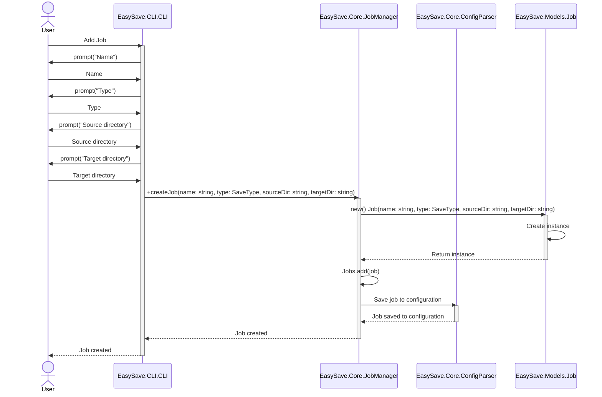
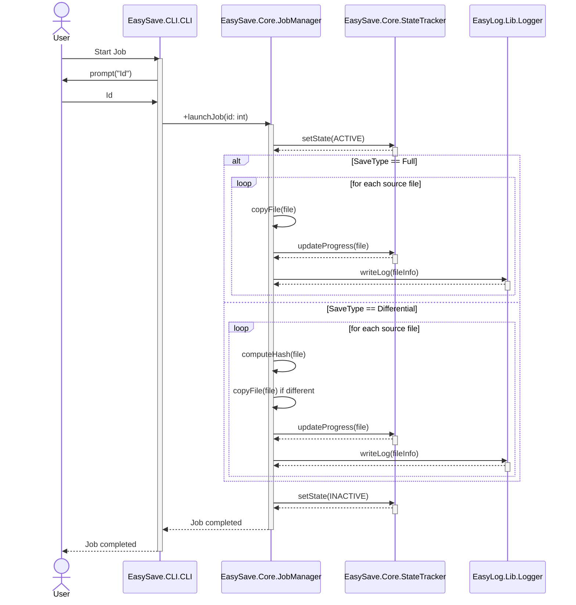
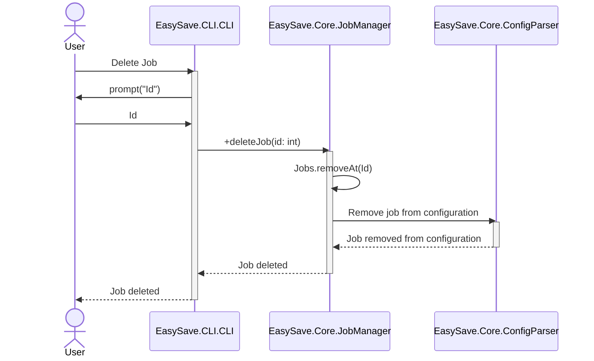
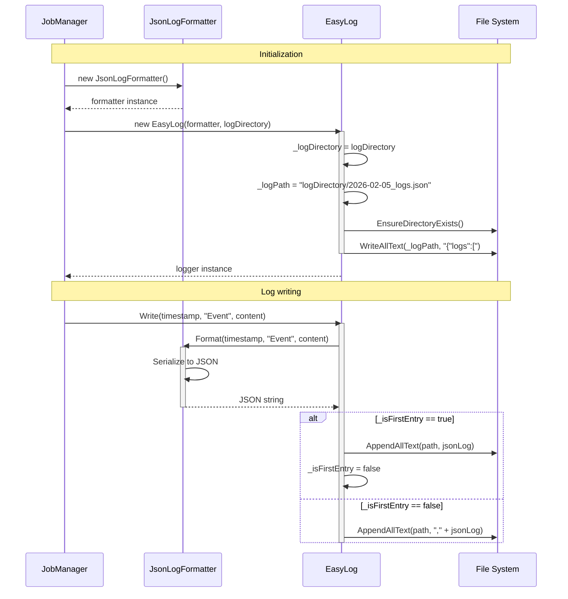

# UML Modeling - EasySave

This document contains the UML diagrams of the **EasySave** project, created with [Mermaid](https://mermaid.js.org/).

## Architecture Overview

The **EasySave** project follows a multi-tier architecture with MVVM pattern for the GUI:

### GUI Layer (MVVM Pattern)
- **ViewModels**: Manage UI logic and state using `INotifyPropertyChanged` for data binding
- **Commands**: Encapsulate user actions via `RelayCommand` implementing `ICommand`
- **Data Binding**: Eliminates code-behind by binding directly to ViewModel properties
- **Event-Driven**: Core components (JobManager, StateTracker) emit events that ViewModels subscribe to
- **Localization**: All labels are computed properties that update on language changes

### Core & Logging Layers
- **JobManager**: Central orchestrator coordinating backup jobs, state tracking, and logging
- **StateTracker**: Manages job state persistence and change notifications
- **EasyLog**: Local logging client that writes logs to files (JSON/XML formats)
- **SocketServer**: Remote TCP logging server that receives and persists logs from clients
- **ILogFormatter**: Interface supporting multiple log format implementations

## 1. Use Case Diagram


## 2. Class Diagram

Overview of the main classes of the project and their relationships.

### 2.1. Simplified version

```mermaid
classDiagram
  CLI --> JobManager
  App --> MainWindow
  SocketServer --> EasyLog

  MainWindow --> MainWindowViewModel

  MainWindowViewModel o-- JobsPageViewModel
  MainWindowViewModel o-- LogsPageViewModel
  MainWindowViewModel o-- SettingsPageViewModel

  JobsPageViewModel --> JobManager
  JobsPageViewModel *-- "0..5" JobViewModel
  LogsPageViewModel --> JobManager
  SettingsPageViewModel --> JobManager

  JobViewModel --> Job
  JobViewModel --> RelayCommand

  JobManager *-- "0..5" Job
  JobManager o-- EasyLog
  JobManager o-- StateTracker
  JobManager --> ConfigParser
  JobManager o-- ILogFormatter

  ConfigParser ..> Job

  Job --> JobType
  StateEntry --> JobState

  EasyLog o-- ILogFormatter
  ILogFormatter <|.. JsonLogFormatter
  ILogFormatter <|.. XmlLogFormatter

  JobManager ..> LogEntry
  JobManager ..> StateEntry
  StateTracker ..> StateEntry

  ViewModelBase <|-- MainWindowViewModel
  ViewModelBase <|-- JobsPageViewModel
  ViewModelBase <|-- LogsPageViewModel
  ViewModelBase <|-- SettingsPageViewModel
  ViewModelBase <|-- JobViewModel

  namespace EasySave.CLI {
    class CLI {
      -JobManager _jobManager
      +WriteLine(message: string) void
      +start() void
      -CreateJob() void
      -DeleteJob() void
      -ShowJobs() void
      -ChangeLanguage() void
      -ExecuteJobs() void
    }
  }

  namespace EasySave.GUI {
    class App {
      +Initialize() void
      +OnFrameworkInitializationCompleted() void
    }

    class MainWindow {
      +MainWindow()
    }
  }

  namespace EasySave.Core {
    class JobManager {
      -List~Job~ _jobs
      -EasyLog _logger
      -ConfigParser _configParser
      -ILogFormatter _logFormatter
      -StateTracker _stateTracker
      +CreateJob(name: string, type: JobType, sourcePath: string, destinationPath: string) void
      +removeJob(index: int) void
      +GetJobs() List~Job~
      +Close() void
      +LaunchJob(job: Job, password: string) void
      +LaunchMultipleJobsAsync(jobs: List~Job~, password: string) Task
      +PauseJob(job: Job) void
      +ResumeJob(job: Job) void
      +StopJob(job: Job) void
      +CheckBusinessApplications() string?
      -CreateLogFormatter() ILogFormatter
      -LoadJobsFromConfig() void
      -SaveJobToConfig(job: Job) void
      -RemoveJobFromConfig(jobName: string) void
      -ExecuteFullBackup(job: Job, createHashFile: bool) void
      -ExecuteDifferentialBackup(job: Job) void
    }

    class StateTracker {
      -string _stateFilePath
      -Dictionary~string, StateEntry~ _jobStates
      +UpdateJobState(stateEntry: StateEntry) void
      +RemoveJobState(jobName: string) void
    }

    class ConfigParser {
      -string _configPath
      +JsonNode? Config
      +LoadConfig() void
      +EditAndSaveConfig(newConfig: JsonNode) void
      +saveJobs(jobs: List~Job~) void
      -SaveConfig() void
    }
  }

  namespace EasySave.Models {
    class Job {
      +string Name
      +JobType Type
      +string SourcePath
      +string DestinationPath
      +ToString() string
    }

    class JobType {
      <<enumeration>>
      Full
      Differential
    }

    class LogEntry {
      +DateTime Timestamp
      +string BackupName
      +string SourcePath
      +string DestinationPath
      +long FileSize
      +int TransferTimeMs
      +ToNormalizedFormat() (DateTime, string, Dictionary~string, object~)
    }

    class StateEntry {
      +string JobName
      +DateTime LastActionTime
      +JobState State
      +int? TotalFiles
      +long? TotalSizeToTransfer
      +double? Progress
      +int? RemainingFiles
      +long? RemainingSizeToTransfer
      +string? CurrentSourcePath
      +string? CurrentDestinationPath
      +ToString() string
    }

    class JobState {
      <<enumeration>>
      Active
      Paused
      Inactive
    }
  }

  namespace EasyLog.lib {
    class EasyLog {
      -ILogFormatter _formatter
      -string _logDirectory
      -string _logPath
      -bool _isFirstEntry
      -DateTime _currentDate
      -string _fileExtension
      -string _entrySeparator
      +Write(timestamp: DateTime, name: string, content: Dictionary~string, object~) void
      +SetLogPath(newLogDirectory: string) void
      +GetCurrentLogPath() string
      +GetLogDirectory() string
      +Close() void
      -GetLogPathForDate(date: DateTime) string
      -InitializeLogStructure() void
      -EnsureFileIsOpen() void
      -NormalizePathsInContent(content: Dictionary~string, object~) void
      -ConvertToUncPath(path: string) string
      -CheckAndRotateIfNeeded() void
      -EnsureDirectoryExists(directory: string) void
    }

    class ILogFormatter {
      <<interface>>
      +Format(timestamp: DateTime, name: string, content: Dictionary~string, object~) string
      +Close(filePath: string) void
    }

    class JsonLogFormatter {
      +Format(timestamp: DateTime, name: string, content: Dictionary~string, object~) string
      +Close(filePath: string) void
    }

    class XmlLogFormatter {
      +Format(timestamp: DateTime, name: string, content: Dictionary~string, object~) string
      +Close(filePath: string) void
      -SanitizeXmlElementName(name: string) string
    }
  }
```

### 2.2. Detailed version

This version details all components of the GUI module with all its associated namespaces (Pages, Components, Dialogs, Converters, ViewModels, Commands). It shows the complete internal structure of the graphical interface with the MVVM architecture.

```mermaid
classDiagram
  CLI --> JobManager
  App --> MainWindow
  SocketServer --> EasyLog

  MainWindow --> MainWindowViewModel
  MainWindow *-- JobsPage
  MainWindow *-- LogsPage
  MainWindow *-- SettingsPage

  MainWindowViewModel o-- JobsPageViewModel
  MainWindowViewModel o-- LogsPageViewModel
  MainWindowViewModel o-- SettingsPageViewModel
  MainWindowViewModel --> RelayCommand

  JobsPage --> JobsPageViewModel
  JobsPage *-- "0..5" JobCard
  JobsPage --> CreateJobDialog
  JobsPage --> ErrorDialog
  JobsPage --> PasswordDialog

  JobsPageViewModel --> JobManager
  JobsPageViewModel *-- "0..5" JobViewModel
  JobsPageViewModel --> RelayCommand

  JobViewModel --> Job
  JobViewModel --> RelayCommand

  LogsPage --> LogsPageViewModel
  LogsPage *-- "0..*" LogEntryViewModel

  LogsPageViewModel --> ConfigParser
  LogsPageViewModel --> JobManager
  LogsPageViewModel --> RelayCommand

  SettingsPage --> SettingsPageViewModel
  SettingsPageViewModel --> ConfigParser
  SettingsPageViewModel --> JobManager
  SettingsPageViewModel --> RelayCommand

  JobCard --> JobViewModel
  JobCard --> JobTypeColorConverter
  JobCard *-- CustomCheckBox

  CreateJobDialog --> JobResult
  CreateJobDialog --> JobType

  JobManager *-- "0..5" Job
  JobManager o-- EasyLog
  JobManager o-- StateTracker
  JobManager --> ConfigParser
  JobManager o-- ILogFormatter

  ConfigParser ..> Job

  Job --> JobType
  StateEntry --> JobState

  EasyLog o-- ILogFormatter
  ILogFormatter <|.. JsonLogFormatter
  ILogFormatter <|.. XmlLogFormatter

  JobManager ..> LogEntry
  JobManager ..> StateEntry
  StateTracker ..> StateEntry

  namespace EasySave.CLI {
    class CLI {
      -JobManager _jobManager
      +WriteLine(message: string) void
      +start() void
      -CreateJob() void
      -DeleteJob() void
      -ShowJobs() void
      -ChangeLanguage() void
      -ExecuteJobs() void
    }
  }

  namespace EasySave.GUI {
    class App {
      +Initialize() void
      +OnFrameworkInitializationCompleted() void
    }

    class MainWindow {
      +MainWindow()
    }
  }

  namespace EasySave.GUI.Pages {
    class JobsPage {
      -JobsPageViewModel? _viewModel
      +JobsPage()
      -OnLoaded(sender: object, e: RoutedEventArgs) void
      -OnCreateJobClicked(sender: object?, e: RoutedEventArgs) void
      -ShowCreateJobDialog() void
      -ShowPasswordDialog(vm: JobViewModel) void
      -ShowRunSelectedDialog() void
      -ShowErrorDialog(message: string) void
    }

    class LogsPage {
      -LogsPageViewModel? _viewModel
      +LogsPage()
      -OnLoaded(sender: object, e: RoutedEventArgs) void
    }

    class SettingsPage {
      -SettingsPageViewModel? _viewModel
      +SettingsPage()
      -OnLoaded(sender: object, e: RoutedEventArgs) void
    }

    class SimpleLogEntry {
      +string LogText
    }
  }

  namespace EasySave.GUI.Components {
    class CustomCheckBox {
      -bool _isChecked
      +event EventHandler~bool~? CheckedChanged
      +bool IsChecked
      +CustomCheckBox()
      +Toggle() void
      +SetChecked(value: bool) void
      -UpdateVisuals() void
    }

    class JobCard {
      -JobViewModel? _viewModel
      +JobCard()
      -OnLoaded(sender: object, e: RoutedEventArgs) void
    }
  }

  namespace EasySave.GUI.Dialogs {
    class CreateJobDialog {
      -JobResult _result
      +CreateJobDialog()
      -OnLoaded(e: RoutedEventArgs) void
      -BrowseSourceButton_Click(sender: object, e: RoutedEventArgs) void
      -BrowseDestinationButton_Click(sender: object, e: RoutedEventArgs) void
      -CreateButton_Click(sender: object, e: RoutedEventArgs) void
      -CancelButton_Click(sender: object, e: RoutedEventArgs) void
    }

    class JobResult {
      +string Name
      +JobType Type
      +string SourcePath
      +string DestinationPath
    }

    class ErrorDialog {
      +ErrorDialog(title: string, message: string)
    }

    class PasswordDialog {
      +PasswordDialog()
    }
  }

  namespace EasySave.GUI.Converters {
    class JobTypeColorConverter {
      +Convert(value: object, targetType: Type, parameter: object, culture: CultureInfo) object
      +ConvertBack(value: object, targetType: Type, parameter: object, culture: CultureInfo) object
    }
  }

  namespace EasySave.GUI.Commands {
    class RelayCommand {
      <<implementation>>
      -Action~object?~ _execute
      -Func~object?, bool~? _canExecute
      +RelayCommand(execute: Action~object?~, canExecute: Func~object?, bool~?)
      +event EventHandler? CanExecuteChanged
      +CanExecute(parameter: object?) bool
      +Execute(parameter: object?) void
      +RaiseCanExecuteChanged() void
    }
  }

  namespace EasySave.GUI.ViewModels {
    class ViewModelBase {
      <<abstract>>
      +event PropertyChangedEventHandler? PropertyChanged
      #SetProperty~T~(ref field: T, value: T, propertyName: string) void
      #OnPropertyChanged(propertyName: string) void
    }

    class MainWindowViewModel {
      -JobManager _jobManager
      -ViewModelBase _currentPage
      +MainWindowViewModel()
      +JobsPageViewModel JobsPageVm
      +LogsPageViewModel LogsPageVm
      +SettingsPageViewModel SettingsPageVm
      +ViewModelBase CurrentPage
      +bool IsJobsActive
      +bool IsLogsActive
      +bool IsSettingsActive
      +string WindowTitle
      +string JobsButtonLabel
      +string LogsButtonLabel
      +string SettingsButtonLabel
      +ICommand NavigateToJobsCommand
      +ICommand NavigateToLogsCommand
      +ICommand NavigateToSettingsCommand
      -NavigateTo(page: ViewModelBase) void
      -OnLanguageChanged(sender: object?, e: LanguageChangedEventArgs) void
      +Dispose() void
    }

    class JobsPageViewModel {
      -JobManager _jobManager
      -bool _isSelectionBarVisible
      -string _selectionCountText
      +JobsPageViewModel(jobManager: JobManager)
      +ObservableCollection~JobViewModel~ Jobs
      +bool IsSelectionBarVisible
      +string SelectionCountText
      +string HeaderTitle
      +string HeaderSubtitle
      +string CreateJobLabel
      +string DeselectAllLabel
      +string RunSelectedLabel
      +ICommand CreateJobCommand
      +ICommand DeselectAllCommand
      +ICommand RunSelectedCommand
      +event EventHandler? CreateJobRequested
      +event EventHandler~JobViewModel~? PlayJobRequested
      +event EventHandler? RunSelectedRequested
      +event EventHandler~string~? ErrorOccurred
      -LoadJobs() void
      -SubscribeToJobVM(vm: JobViewModel) void
      +OnJobCreated(name: string, type: JobType, sourcePath: string, destinationPath: string) void
      +ExecutePlayJob(vm: JobViewModel, password: string) Task
      +ExecuteRunSelected(selected: List~JobViewModel~, password: string) Task
      +CheckBusinessApp() string?
      +GetSelectedJobs() List~JobViewModel~
      -UpdateSelectionBar() void
      +Dispose() void
    }

    class JobViewModel {
      -Job _job
      -JobState _state
      -double _progress
      -int? _totalFiles
      -int? _remainingFiles
      -long? _totalSize
      -long? _remainingSize
      -bool _isSelected
      -bool _isExpanded
      -bool _isDeleteConfirming
      +JobViewModel(job: Job)
      +Job Job
      +string Name
      +string SourcePath
      +string DestinationPath
      +string TypeLabel
      +JobState State
      +double Progress
      +int? TotalFiles
      +int? RemainingFiles
      +long? TotalSize
      +long? RemainingSize
      +bool IsSelected
      +bool IsExpanded
      +bool IsDeleteConfirming
      +string StatusLabel
      +ICommand PlayPauseResumeCommand
      +ICommand StopCommand
      +ICommand DeleteCommand
      +ICommand ToggleExpandCommand
      +ICommand ConfirmDeleteCommand
      +ICommand CancelDeleteCommand
      +event EventHandler~JobViewModel~? PlayRequested
      +event EventHandler~JobViewModel~? PauseRequested
      +event EventHandler~JobViewModel~? ResumeRequested
      +event EventHandler~JobViewModel~? StopRequested
      +event EventHandler~JobViewModel~? DeleteRequested
      +event EventHandler? SelectionChanged
      +ApplyState(entry: StateEntry) void
      -OnPlayPauseResume() void
      -OnStop() void
      -OnDelete() void
      -OnToggleExpand() void
      -OnConfirmDelete() void
      -OnCancelDelete() void
    }

    class LogsPageViewModel {
      -JobManager _jobManager
      -ConfigParser _configParser
      -ObservableCollection~LogEntryViewModel~ _logs
      -int _logsCount
      -string _currentLogFilePath
      -int _lastLoadedLogCount
      +LogsPageViewModel(jobManager: JobManager)
      +ObservableCollection~LogEntryViewModel~ Logs
      +int LogCount
      +string HeaderTitle
      +string OpenFolderLabel
      +string TotalLogsLabel
      +ICommand OpenFolderCommand
      +event EventHandler? LogAdded
      -LoadLogs() void
      -LoadJsonLogs(filePath: string) void
      -LoadXmlLogs(filePath: string) void
      -OnLogEntryWritten(sender: object?, e: LogEntryEventArgs) void
      -OnLanguageChanged(sender: object?, e: LanguageChangedEventArgs) void
      -OnLogFormatChanged(sender: object?, e: LogFormatChangedEventArgs) void
      -OpenFolder() void
      +Dispose() void
    }

    class LogEntryViewModel {
      -string _logText
      +LogEntryViewModel(logText: string)
      +string LogText
    }

    class SettingsPageViewModel {
      -ConfigParser _configParser
      -JobManager _jobManager
      -string _newPriorityExtensionText
      -string _newEncryptionExtensionText
      -string _newBusinessAppText
      -string _maxConcurrentJobs
      -long _largeFileSizeLimitKb
      +SettingsPageViewModel(jobManager: JobManager)
      +string HeaderTitle
      +string LogsSectionTitle
      +string EncryptionSectionTitle
      +string BusinessAppsSectionTitle
      +string PrioritySectionTitle
      +string PerformanceSectionTitle
      +string LanguageSectionTitle
      +string CurrentLanguageValue
      +string LogsFormatValue
      +string StatePathValue
      +string VersionValue
      +string NewPriorityExtensionText
      +string NewEncryptionExtensionText
      +string NewBusinessAppText
      +string MaxConcurrentJobs
      +long LargeFileSizeLimitKb
      +ObservableCollection~ExtensionItemViewModel~ EncryptionExtensions
      +ObservableCollection~AppItemViewModel~ BusinessApps
      +ObservableCollection~ExtensionItemViewModel~ PriorityExtensions
      +ICommand SetJsonFormatCommand
      +ICommand SetXmlFormatCommand
      +ICommand SetFrenchLanguageCommand
      +ICommand SetEnglishLanguageCommand
      +ICommand AddPriorityExtensionCommand
      +ICommand AddEncryptionExtensionCommand
      +ICommand AddBusinessAppCommand
      -SetLogFormat(format: string) void
      -AddPriorityExtension() void
      -AddEncryptionExtension() void
      -OnLanguageChanged(sender: object?, e: LanguageChangedEventArgs) void
      -OnLogFormatChanged(sender: object?, e: LogFormatChangedEventArgs) void
      +Dispose() void
    }

    class ExtensionItemViewModel {
      +string DisplayText
      +ICommand RemoveCommand
      +ExtensionItemViewModel(ext: string, removeCallback: Action~ExtensionItemViewModel~)
    }

    class AppItemViewModel {
      +string DisplayText
      +ICommand RemoveCommand
      +AppItemViewModel(name: string, removeCallback: Action~AppItemViewModel~)
    }
  }

  namespace EasySave.Core {
    class JobManager {
      -List~Job~ _jobs
      -EasyLog _logger
      -ConfigParser _configParser
      -ILogFormatter _logFormatter
      -StateTracker _stateTracker
      +CreateJob(name: string, type: JobType, sourcePath: string, destinationPath: string) void
      +removeJob(index: int) void
      +GetJobs() List~Job~
      +Close() void
      +LaunchJob(job: Job, password: string) void
      +LaunchMultipleJobsAsync(jobs: List~Job~, password: string) Task
      +PauseJob(job: Job) void
      +ResumeJob(job: Job) void
      +StopJob(job: Job) void
      +CheckBusinessApplications() string?
      -CreateLogFormatter() ILogFormatter
      -LoadJobsFromConfig() void
      -SaveJobToConfig(job: Job) void
      -RemoveJobFromConfig(jobName: string) void
      -ExecuteFullBackup(job: Job, createHashFile: bool) void
      -ExecuteDifferentialBackup(job: Job) void
    }

    class StateTracker {
      -string _stateFilePath
      -Dictionary~string, StateEntry~ _jobStates
      +UpdateJobState(stateEntry: StateEntry) void
      +RemoveJobState(jobName: string) void
    }

    class ConfigParser {
      -string _configPath
      +JsonNode? Config
      +LoadConfig() void
      +EditAndSaveConfig(newConfig: JsonNode) void
      +saveJobs(jobs: List~Job~) void
      -SaveConfig() void
    }
  }

  namespace EasySave.Models {
    class Job {
      +string Name
      +JobType Type
      +string SourcePath
      +string DestinationPath
      +ToString() string
    }

    class JobType {
      <<enumeration>>
      Full
      Differential
    }

    class LogEntry {
      +DateTime Timestamp
      +string BackupName
      +string SourcePath
      +string DestinationPath
      +long FileSize
      +int TransferTimeMs
      +ToNormalizedFormat() (DateTime, string, Dictionary~string, object~)
    }

    class StateEntry {
      +string JobName
      +DateTime LastActionTime
      +JobState State
      +int? TotalFiles
      +long? TotalSizeToTransfer
      +double? Progress
      +int? RemainingFiles
      +long? RemainingSizeToTransfer
      +string? CurrentSourcePath
      +string? CurrentDestinationPath
      +ToString() string
    }

    class JobState {
      <<enumeration>>
      Active
      Paused
      Inactive
    }
  }

  namespace EasyLog.lib {
    class EasyLog {
      -ILogFormatter _formatter
      -string _logDirectory
      -string _logPath
      -bool _isFirstEntry
      -DateTime _currentDate
      -string _fileExtension
      -string _entrySeparator
      +Write(timestamp: DateTime, name: string, content: Dictionary~string, object~) void
      +SetLogPath(newLogDirectory: string) void
      +GetCurrentLogPath() string
      +GetLogDirectory() string
      +Close() void
      -GetLogPathForDate(date: DateTime) string
      -InitializeLogStructure() void
      -EnsureFileIsOpen() void
      -NormalizePathsInContent(content: Dictionary~string, object~) void
      -ConvertToUncPath(path: string) string
      -CheckAndRotateIfNeeded() void
      -EnsureDirectoryExists(directory: string) void
    }

    class ILogFormatter {
      <<interface>>
      +Format(timestamp: DateTime, name: string, content: Dictionary~string, object~) string
      +Close(filePath: string) void
    }

    class JsonLogFormatter {
      +Format(timestamp: DateTime, name: string, content: Dictionary~string, object~) string
      +Close(filePath: string) void
    }

    class XmlLogFormatter {
      +Format(timestamp: DateTime, name: string, content: Dictionary~string, object~) string
      +Close(filePath: string) void
      -SanitizeXmlElementName(name: string) string
    }
  }

  namespace EasyLog.Server {
    class SocketServer {
      -Socket? _listenerSocket
      -int _port
      -EasyLog _logger
      -bool _isRunning
      +SocketServer(port: int, logDirectory: string)
      +Start() void
      +Stop() void
      -HandleClientAsync(clientSocket: Socket) Task
    }
  }
```


## 3. Sequence Diagrams

### 3.1 Adding a Job



### 3.2 Starting a Job



### 3.3 Deleting a Job



### 3.4 JSON local Logger


