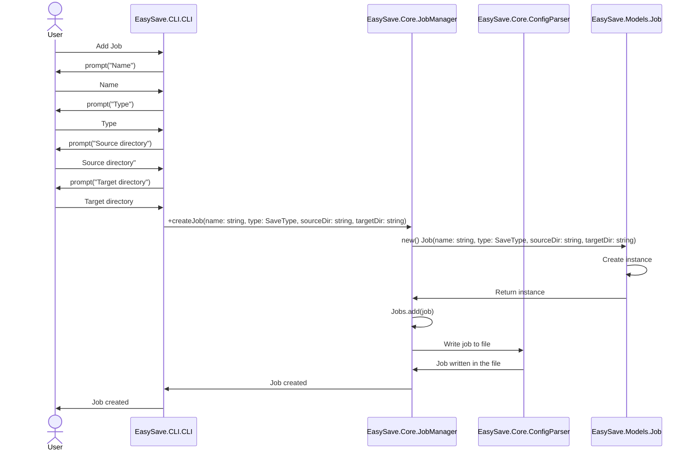
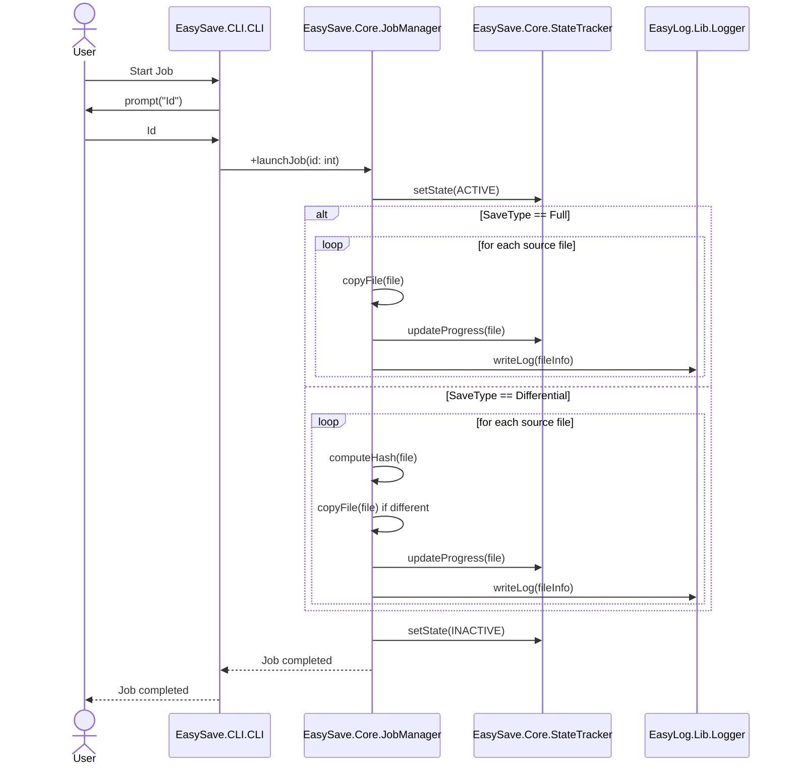
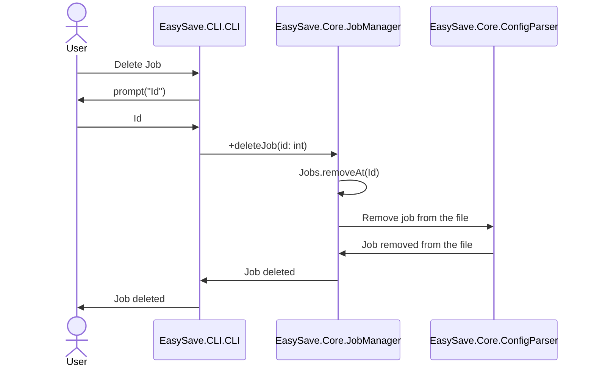
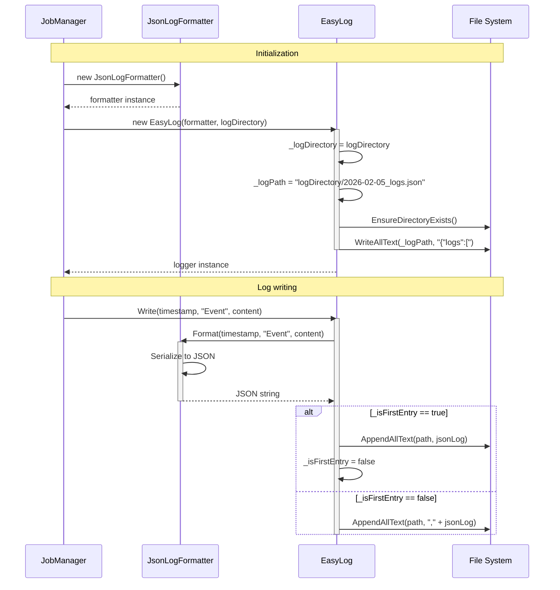

# Modélisation UML - EasySave

Ce document regroupe les diagrammes UML du projet **EasySave**, réalisés avec [Mermaid](https://mermaid.js.org/).

## 1. Diagramme de Classes

Vue d'ensemble des principales classes du projet et de leurs relations.

```mermaid
classDiagram
  CLI --> JobManager

  JobManager *-- "0..5" Job
  JobManager o-- EasyLog
  JobManager o-- StateTracker

  JobManager --> ConfigParser
  ConfigParser ..> Job

  Job --> SaveType
  StateEntry --> StateType

  EasyLog o-- ILogFormatter
  ILogFormatter <|.. JsonLogFormatter

  JobManager ..> LogEntry
  JobManager ..> StateEntry
  StateTracker ..> StateEntry

  namespace EasySave.CLI {
	  class CLI {
		-JobManager : JobManager
	    +Start() void
	    +WriteLine(message: string) void
	  }
	}

	namespace EasySave.Core {
	  class JobManager {
	    -List~Job~ Jobs
	    -EasyLog Logger
	    -StateTracker StateTracker
	    +createLogger() void
	    +createJob(name: string, type: SaveType, sourceDir: string, targetDir: string) void
	    +deleteJob(id: int) void
	    +launchJob(id: int) void
	  }

      class StateTracker {
	    -string StatePath
	    +addOrEditJobState(state: StateEntry) void
	  }

      class ConfigParser {
        -string _configPath
        -JSON Config
        +LoadConfig() void
        +EditAndSaveConfig(newConfig: JSON) void
        +saveJobs(jobs: List<Job>) void
      }
  }

  namespace EasySave.Models {
	  class Job {
	    -string Name
	    -SaveType Type
	    -string SourceDir
	    -string TargetDir
	  }
	  class SaveType {
	    <<enumeration>>
	    Full
	    Differential
	  }
	  class LogEntry {
		  -string Name
		  -Datetime Timestamp
		  -string SourceFile
		  -string TargetFile
		  -long SizeFile
		  -long CopyTime
		  +ToString() string
	  }
	  class StateEntry {
		  -string Name
          -StateType State
          -long? TotalSize = null
          -float? Progress = null
          -long? RemainingSize = null
          +ToString() string?
	  }
      class StateType {
	    <<enumeration>>
	    Active
	    Inactive
	  }
  }

  namespace EasyLog.lib {
	  class EasyLog {
        -ILogFormatter _formatter
        -string _logPath
        +Write(timestamp: DateTime, name: string, content: Dictionary<string, object>) void
        +SetLogPath(newLogPath string) void
        +GetCurrentLogPath() string
        -EnsureDirectoryExists(logPath string) void
	  }

      class ILogFormatter {
        +Format(timestamp: DateTime, name: string, content: Dictionary<string, object>) string
      }

      class JsonLogFormatter {
      }
  }
```

## 2. Diagrammes de Séquence

### 2.1 Ajout d'un Job



### 2.2 Lancement d'un Job



### 2.3 Suppression d'un Job



### 2.4 Logger


